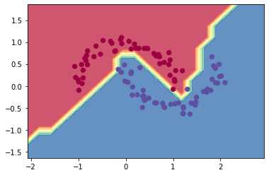

# Kittylyst


A tiny [Catalyst](https://github.com/catalyst-team/catalyst)-like 
experiment runner framework on top of 
[micrograd](https://github.com/karpathy/micrograd).

Implements `Experiment`, `Runner` and `Callback` Catalyst-core abstractions 
and has extra [PyTorch](https://github.com/pytorch)-like micrograd modules - 
`MicroLoader`, `MicroCriterion`, `MicroOptimizer` and `MicroScheduler`.

Every module is tiny, with about 100 lines of code (even this readme).
However, this is enough to make `Kittylyst` easily extendable 
for any number of data sources and support multi-stage experiments,
as the demo notebook shows.

Potentially useful for educational purposes.

### Installation

```bash
pip install kittylyst
```

### Example usage

```python
from micrograd.nn import MLP
import kittylyst as kt

loaders = {"train": kt.MicroLoader(...), "valid": kt.MicroLoader(...)}
model = MLP(2, [16, 16, 1])
criterion = kt.MicroCriterion()
optimizer = kt.MicroOptimizer(model)
scheduler = kt.MicroScheduler(optimizer, num_epochs=10)
experiment = kt.Experiment(
    model=model,
    criterion=criterion,
    optimizer=optimizer,
    scheduler=scheduler,
    loaders=loaders,
    num_epochs=10,
    callbacks=[
        kt.CriterionCallback(),
        kt.AccuracyCallback(),
        kt.OptimizerCallback(),
        kt.SchedulerCallback(),
        kt.LoggerCallback(),
    ],
    verbose=True,
)

kt.SupervisedRunner().run_experiment(experiment)
```

### Running an experiment

The notebook `demo.ipynb` provides a full demo of
running an `Experiment` with `SupervisedRunner`
for  binary classification task.
This is achieved by training `MLP` from `micrograd` module
with a simple svm "max-margin" binary classification loss (`MicroCriterion`)
and SGD (`MicroOptimizer`) with learning rate decay (`MicroScheduler`).

As shown in the notebook, 
using a 2-layer neural net with two 16-node hidden layers 
we achieve the following decision boundary on the moon dataset:



### Running codestyle

To run the codestyle check you will have to install 
[catalyst-codestyle](https://github.com/catalyst-team/codestyle). Then simply:

```bash
catalyst-make-codestyle
```

### License

MIT
